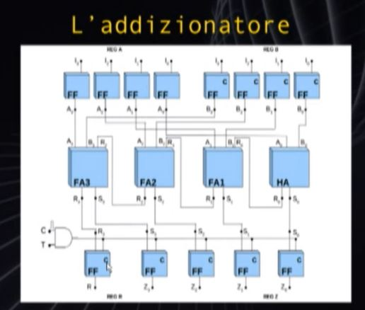
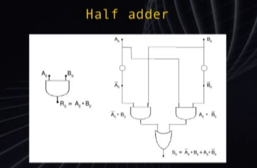
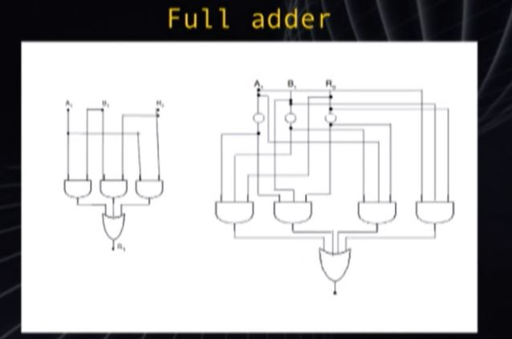

# Unità di Elaborazione
Cioè i circuiti che costituiscono il cuore di qualunque calcolatore

## Trasferimento da Registro a Registro
**Registro** : Insieme di Flip-Flop che rappresenta un unità elementare di memoria

Il clock avviene in contemporanea e in parallelo a tutto il reegistro, che può essere composto da 8 Flip-Flop 8 bit di informazione cioè 1 Byte

Quando l'impulso di clock passa per un registro, esso memorizza il registro collegato. Il clock passa in parallelo simultaneamente al registro dove avviene la copia. Le celle sono collegate 1 a 1 in serie per la copia registro. 

 - 4bit : [U0 -> c * U00][U1 -> c * U01][U2 -> c * U02][U3 -> c * U03]
 - Cioè con impulso di clock : [0 -> 0][1 -> 1][0 -> 0][0 -> 0]

Spesso l'entrata del clock sui registri dove copiare è in AND con il bit T che sta a significare 'Copiamo o Non copiamo'. Se T = 0 il segnale di Clock non passa quindi non avviene la copia

### Trasferimento Molti a 1

 1. Input : 4 Registri Flip-Flop a 4 bit [A, B, C, D] con ogniuno un Flag di copia [TA, TB, TC, TD]
 2. I flag T indicano quale registro va copiato dei 4 e possono essere o tutti 0 o solo uno true/1 e tutti gli altri 0
 3. Se il T_out del registro dove andrà fatta la copia è a True e uno (e solo uno) dei 4 flag a True, allora avverrà la copia
 4. Nel caso di copia essa avverrà nel periodo di clock e sarà copiato il registro con T a True
   
### Trasferimento 1 a Molti
Il Flip-Flop sorgente ha i canali di output sdoppiati.
I registri dove avverranno le copie hanno un T personale, per decidere se compiare in un registro, in nessuno o in entrambi i registri, contemporaneamente al ciclo di clock

## Addizionatore
Insieme dei circuiti che mi permettono di fare la somma tra due numeri

Unità di calcolo =  Unità di Elaborazione

Elaboratore : Unità Ingresso -> Memoria & Unità Elaborazione -> Unità Uscita

Memoria : Memoria Centrale(RAM) + Memoria a Dischi(ROM)

Memoria a Dischi : Accesso lento e sequenziale partendo da un unità

### ALU Arithmetic-Logic Unit
 - Svolge tutti i calcoli Aritmetici e Logici
 - Composta Solitamente da circuiti Combinatori

**Circuito Combinatorio** : E' un componente che restituisce un output basato soltanto dagli input forniti in quell'istante. Non tiene conto della memoria delle sue attività precedenti.

- Esempio unità aritmetica : 0101+0011 = 1000

- HA : Half Adder
- FA : Full Addr
### HA - Half Adder
Adolf Adder

A Sx il Riporto True (1 * 1) a Dx il circuito True (NOT(0) * 1) + (1 * NOT(0))

### FA - Full Adder
A Sx Riporto (Ripo * In_A) + (Ripo*In_B) + (In_A * In_B)

A Dx True 4 AND a 3 Entrate e  1 OR a 4 Entrate :
 - (NOT(In_A) * NOT(In_B) * Ripo) +
 - (NOT(In_A) * In_B * NOT(Ripo)) +
 - (In_A * NOT(In_B) * NOT(Ripo)) +
 - (In_A * In_B * Ripo)

