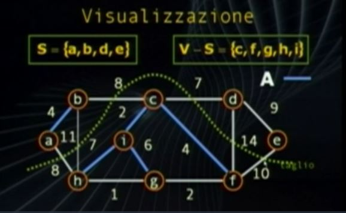

# Alberi di Copertura Minimi
Problema di ottimizzazione sui grafi

Dato un grafo non orientato, connesso e pesato G(V,E).
Determinare un sottografo aciclico T in E 
che connette tutti i vertici in modo che il costo totale sia minimo

Costo totale :
$$
w(t) = \sum_{(u,v) \in t} w(u,v)
$$

Insieme aciclico e connsso = T che è un albero

MST (Minimum Spanning Tree) : Albero di copertura minima

Applicazioni MST : Posatura cavi in una città, 
 - I cavi potrenno essere sotterrati solo in determinate posizioni
 - Costo in lunghezza e difficoltà di installazione(terra vs roccia) 
 - Scopo : Raggiungere ogni Casa minimizzando il costo
  
Modello : Grafo Pesi(Vertici, Archi) = w(V, E) = costo_di_posatura(Case, Possibili Connessioni)

# Algoritmo Generico
MST ha una struttura per cui **algoritmo greedy** fornisce la soluzione ottima.

Strategia consite nel crescere un sottoinsieme A di archi che rimane
sempre un sottoinsieme di un MST.

T : albero(Insieme aciclico e connesso) di copertura minimo

**Archo Sicuro** : Si aggiunge ad ogni passo un arco(u,v) ad A in modo da non violare la proprietà A esiste come sottoinsieme di T

```c
Generic_MST(G, w) {//w : funzione di peso archi
    inizialize_empty(A);
    while (A not us not MST) {
        find_arco_sicuro(u, v);
        A = A + (u, v);
    }
    return A;
}
```

# Definizioni
Taglio tra due sottoinsiemi dei vertici

Un **Taglio S(, V-S)** di un grafo non orientato G=(V,E) è una partizione di V

Un **Arco Attraversa il taglio** se uno dei suoi vertici è in S e l'altro in V-S

Un **Taglio Rispetta un insieme A di Archi** se nessun arco di A attravera il taglio

Un arco **leggero** se il suo peso è minimo tra tutti quelli che attraversano il taglio. 

Esempio arco leggero immagine (c, d) Peso 7, il più leggero degli archi che "taglia" cioè connette i due insiemi diversi



## Teorema
**Individuazione degli archi sicuri :** Dato un Insieme A di Archi tale che sia sempre un sottoinsieme MST ed un taglio che lo rispetta. 
Un arco sicuro è un arco leggero che attraversa il taglio.

## Osservazioni
A sottoinsieme di MST -> A è Aciclico.

Ad ogni passo, il grafo G<sub>A</sub>=(V,A) è una foresta

Ogni componente connessa di G<sub>A</sub> è un albero

Dato che A unito a {(u,v)} deve essere aciclico. Ogni arco sicuro per A connette due componenti G<sub>A</sub>

## Analisi Algoritmo
Inizalmente A insieme vuoto. 
Inizalmente la foresta G<sub>A</sub> consiste di |V| alberi/componenti connesse.

Il ciclo dell'aggiunta archi sicuri avviene per |V|-1 volte.

MST ha al massimo |V|-1 archi.

Ad ogni iterazione l'aggiunta di un arco sicuro riduce di 1 il numero di componenti connesse. Quindi al termine si creerà un albero.

# Algoritmo di Kruskal
Basato sulla costruzion di MST tramite componenti connesse.

Greedy perchè ad ogni passo aggiungiamo alla foresta l'arco di peso minore

Complessità Dipende dalla struttura dati scelta : O(EV)
```c
MST_Kuskal(G, w) { O(|V|-1)
    empty_init(T);
    sort_crescente(G, w);//Ordina gli archi
    for ogni_arco(u, V) {//Ordine in archi leggeri
        if (u e v non connessi in T) {//Perchè non voglio cicli
            T = T + (u, v);
        }
    }
    return T;
}
```
Costi : Ordinamento O(ElogE) + [Ciclo for O(E) * Verifica di connessione  O(V)]

Complessità totale : O(ElogE) + O(E) * O(V) = O(EV) 

