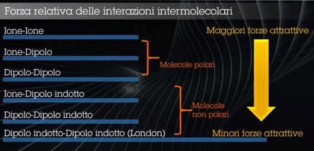

# Reazioni
# Attrazione tra Atomi
**Principio di lettronegatività** la forza di attrazzione da parte del nucleo esercitata sugli elettroni di valenza.
Dipende e Aumenta con:
 - Numero Maggiore di Protoni
 - Distanza Minore tra Nucleo e Elettroni
# Legami
Sono le **forze** che tengono **uniti** gli **atomi** formando molecole
## Legame Primario
E' attuato da codivizione o trasferimento di elettroni tra atomi e dall'attrazione elettrostatica tra protoni e elettroni

Passaggio di uno o più elettroni mantiene il numero di protoni costante ma cambia il numero di elettroni cambiando le cariche in senso negativo o positivo se meno elettroni.

**Ordine di Legame** è il numero intero di elettroni trasferiti. Pochi sono i sistemi con spostamento di cariche intermedie come il benzene C6H6 dove l'ordine di legame è 1.5 per ogni atomo di carbonio

**Tipo di legame** è determinato dalla **differenza di elettronegatività** tra gli atomi coinvolti :
 1. 0-0.4 Legame Covalente
 2. 0.4-2.5 Legame Eteropolare
 3. 2-2.6 Legame Eteropolare tendente allo ionico
 4. 2.6-3.3 Legame Ionico (da Atomi Ioni -> legame polare)
## Ioni
Se a causa della differenza di elettronegatività :
 - Un Primo atomo aumenta gli elettroni assumerà carica negativa **anione**
 - Un secondo atomo cede gli elettroni assumera carica positiva **catione**
 - La somma di elettroni è la stessa di partenza e la carica è direttamente proporzionale al numero di elettroni scambiati
## Dipoli Permanenti
Quando due atomi in una molecola hanno elettronegatività differente e un atomo attrae gli elettroni esterni di legame più dell'altro, aquisendo una parziale carica negativa e inducendo una parziale carica positiva nell'altro atomo
## Dipolo Temporaneo
In una  molecola apolare la distribuzione della nuvola elettronica è simmetrica (o assimetrica). La fluttuazione della nuvola sposta la carica creando dipoli istantanei.
Importanti perchè possono invertire la polarità di una molecola in maniera non prevista della reazione chimica
## Molecola
Basata sul **legame chimico** di due o più atomi
 - Legame intramolecolare sono quelli che formano la molecola :
   - Legami : Ionico, Covalente(puro, polare e dativo) e Metallico
 - Legame intermolecolare di formano tra molecole diverse vicine fra loro
   - Legami : Idrogeno, dipolo-dipolo, ione-dipolo e di Van der Waals
## Differenze Legame
Legami basati sul trasferimento elettronico **Legame Covalente vs Legame Dativo** :
 - Legame Covalente messa in comune elettroni
 - Lgame Dativo : un atomo cede un doppietto elettronico e un altro atomo funge da accettore
## Legame Metallico
Caratterizzato dalla scarsa attrazzione del nucleo agli elettroni più esterni, liberi quindi di spostarsi/fluttuare da un atomo all'altro. La struttura è come un intelaiatura di ioni positivi immersi in una nube elettronica che li tiene legati
## Legame Dativo
Legame covalente in cui gli atomi di legame provengono dallo steso atomo
## Legame Ione-Dipolo
Legame di tipo elettrostatico tra una molecola polare e uno ione.

Alla base della soluità dei sali in acqua : NaCl+H2O -> Na+ Cl- H20 -> (Cl--H-2O--Na). Parte negativa si lega all'idrogeno positivo e parte positiva all'ossigeno che è negativo
## Legami di Van der Waals
Legami deboli tra molecole elettricamente neutre ma con caratteristiche polari proprie o indotte. Può essere tra :
 - Due Molecole Polari
 - Due Molecole Apolari
 - Una Molecola Polare e Una Molecola Apolare
## Legame/Ponte Idrogeno
**Forza Intermolecolare** in cui un Atomo di Idrogeno ha un legame covalente con elementi molto elettronegativi come H2O : Fluoro F, Ossigeno O, Azoto N. Idrogeno assume più carica positiva

#  Tabella Forze Legami

TODO : lez 6