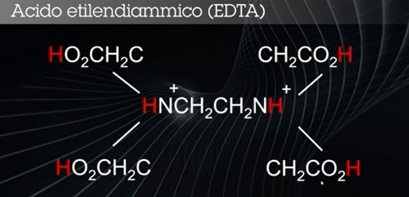

# Reazioni
## Equilibri di Solubilità
<-> : Indica un equilbrio

A B <-> C D
Prodotti C D, Reagenti A B
Concentrazione K = (C * D) / (A * B)
**K** dipende sempre dalla **temperatura**
Attività : diverso da concentrazione, fa riferimento alla parte capace di reagire e non al totale

AB + XY <-> AY + BX

K = AY * BX / AB * XY

Es. AgNO3 + KCl <-> AgCl + KNO3

Nitrato d'Argento + Cloruro di Potassio = Cloruro d'Argento + Nitrato di Potassio

## Dissoluzione
AY + L <-> AL + Y

Pr Discogliere composti insolubili è necessario introdurre 
un reagente capace di legare il catione e/o l'anione

Sciolgo cloruro d'argento tramite ammoniaca
AgCl  + 2NH3 -> [Ag(NH3)2]+ + Cl-

## Reazioni Acido - 
3 Teorie :
 1. Dissociazione elettrolitica - Arrhenius
 2. Coppia Acido/Base - Bronsted/Lowry
 3. Elettronica - Lewis

### Dissociazione Elettrolitica 
Teoria di Arrhenius .
Acido o Base per dissociazione elettrolitica, che dipende dalla costante dielettrica del mezzo
Esempio l'H2O ha una costante elevata
 - **Acido** : Quando per dissociazione elettrolitica c'è produzione di **Ione Idrogeno H+**
 es. AH <-> A- + H+
 - **Base** : Quando per dissociazione elettrolitica c'è produzione di **Ione Ossidrile OH-**
 es.
BOH <-> B+ + OH-

### Coppie Acido/Base
Teoria di Bronsted/Lowry . 
Definisce l'acido o la base in funzione del partner :
Una base si comporta da base solo se c'è un acido e viceversa
 - AH/A- : AH acido, A- base
 - BOH/B+ : BOH base, B+ acido
Quindi AH e B+ acidi

**Neuralizzazione :** Unisco l'acido con la base 
AH + BOH <-> AB + H2O . Prodotto : Sale + Acqua

Acido(Acido Cloridrico) + Base (Idrossido di Sodio) <=> Prodotto : Sale + Acqua
HCl + NaOH <=> NaCl + H2O

**Acido Forte** cede il suo protone, ione H+, più facilmente di un **Acido Debole**
Es. 
1. Acido Forte + Acido Debole : HCl + H2O -> Cl-+ H3O+
2. Acido meno Forte(Acetico) + Acido Debole : CH3COOH + H2O <- CH3COO-+ H3O+

 - pH Reazione 1 : 0-3
 - pH Reazione 2 : 3-6
  
Acido Carbonico CO2 + H2O <- H2CO3
Reazione Fortemente spostata verso sinistra per equilibrio pH

### Elettronica
Reazioni Acido-Base sotto la Teoria di Lewis.
 - **Base :** Donatore di un doppietto di elettroni(Lone Pair)
 - **Acido  :** Accettore di un doppietto di elettroni(Lone Pair)
 - **Lone Pair :** doppietto di elettroni isolati
 - Es. Acido "A" da un doppietto all'Idrogeno H e Forma AH

Rame(Acido) + Ammoniaca(Base - Donatore) : Base
Cu2+ + 4NH3 <=> Cu(NH3)42+

## Complessi
Basati sulla **Teoria Elettronica - di Lewis** e Reazioni di Complessazione.
Basata sul atomo donatore Lone Pair che è il  **complessante** e l'atomo accettore è il **complessato**

**Complessi : Legame Dativo** fra donatore-ligandi e accettore-metalli

Cu2+ + 4NH3 <=> Cu(NH3)42+

Acido/Complessato + Base/Complessante o Chelante <=> Complesso Solubile

### Equilibri di Complessazione K
E' l'espressione più generale del rapporto tra **accettore e donatore**. 
Più è alto il rapporto più avviene la reazione più composto viene prodotto

AB + HL <=> AL + HB

**K** cresce con la stabilità di AL. 
C'è la **Possibilità** di modulare la reazione variando il **pH**.

### Complessanti Chelanti
Complessi per i quali il legame contiene più di un atomo donatore (detto atomo dente)
Porta a formare anelli, perchè più punti d'aggancio, che stabilizzano la molecola.

## EDTA
Composto Base per reazioni di riconoscimento composti

**Acido etilendiamminico**

Ha **6 potenziali siti di legame** : 2 atomi Azoto e 4 gruppi carbossilici.
Quindi ogni molecola di EDTA può formare 6 legami coordinativi con lo stesso ione metallico.
Ne risulta un compleso 1:1 a elevata stabilità, una struttura caratterizzata da diversi anelli a 5 termini.

Metallon+ + EDTA4- -> M(EDTA)n-4

I 6 siti di legame agiscono come acidi e basi deboli, modulati in base al pH della soluzione
Così può esseee resa una reazione selettiva tipo se ci sono 2 metalli e se ne vuole scegliere uno.

Per la reazione ci deve essere una perdita di ioni idrogeno così che l'EDTA possa creare legami.
Cioè senza protoni, -4 ioni H.

Per determinare e la forza con la quale l'EDTA sarà in grado di
complessare gli ioni mtallici di una soluzione, è necessario conoscere il pH della soluzione
e la qualità di agente chelante che in quelle condizioni è presente come EDTA

- Forza complessate maggiore pH basico(ph>10) -4 protoni, e abbastanza EDTA come concentrazione
- pH acido protoni non dissociati forza complessante EDTA sul metallo minore.

Lez.8