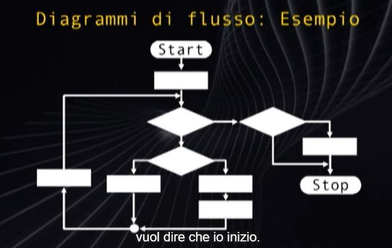

# Diagrammi di Flusso
Disegno Formale che porta a una soluzione, dato un problema, tramite una forma grafica. Utilizzati non solo nell'informatica ma per identificare una sequenza di opeazioni necessarie per uno o più obbiettivi.

1. Blocchi di Inizio e Fine - Rettangolo smussato
2. Azione Generica - Rettangolo
3. Azione di I/O - Parallelepipedo
4. Decisione/Condizione a 2 Uscite : True o False - Rombo
5. Blocco di Connessione - puntino pieno

### If - Then - Else

### If - Then

## Iterazione
### While-Do

### Do-While

### Teorema di Bohm  - Jacopini
Qualunque Diagramma di Flusso può essere trasformato in un Diagramma di Flusso Strutturato(con componenti sopra elencate) Equivalente a quello Dato

### Equazione 2° Grado ax2+bx+c=0
 1. Delta = b2-4ac
 2. Delta > 0 : Allora Esistono Soluzioni in R
 3. Delta = 0 : x = -b/2a
 4. Delta > 0 : x1 = (-b - sqrt(Delta))/2a ; x2 = (-b + sqrt(Delta))/2a

## Fare Attenzione ai Casi Limiti
Senno l'Algoritmo è Sbagliato
L'Algoritmo potrebbee agire in maniera erronea, ma se fosse una macchina, ciò causerebbe danni, tipo una divisione per 0 non gestita.

Sorgente Risoluzioni Equazioni 2° grado

### Rappresentazione dei Dati

Sorgente gestione treni : Dato un orario ferroviario, si individui tutti i treni che entro due ore dall'ora prefissata raggiungano la meta desiderata. Orario : 
 1. Stazione Partenza : char[]
 2. Stazione Arrivo : char[]
 3. Ora di Partenza : int
 4. Minuto di Partenza : int

Numero totale delle linee : N.
Soluzione : 
 1. Tempo totale : in Minuti cioè 60*Ore + minuti
 2. Confronto e calcoli direttamente con minuti
 3. Stazione di Partenza è quella selezionata?
 4. ->NO-> Linea Sucessiva
 5. ->SI-> Controllo la stazione d'Arrivo? 
 6. ->NO-> Linea Sucessiva
 7. ->SI-> Controllo l'Orario, il treno è nelle 2 ore?
 8. ->NO-> Linea Sucessiva
 9. ->SI-> Salvo il Treno
 10. Non ci sono altre linee sucessive : Do i treni salvati
 11. Se non ci sono treni salvati lo dico
 12. Gestione Orario quando supera le 24.00

### Sorgenti
 - Esercizio Stazione Treni entro 2 ore
 - Esercizio Torri Faro Isola:
Isola che sta dentro 100m x 100m : ognini blocco ha l'altezza dal livello del mare.
Massimo della colonna è anche masimo della riga? Se si vedo il mare.
Fai da 1 a 4 torri per vedere il mare : max -> 2 torri riga massimo e colonna massimo
Esercizio C

