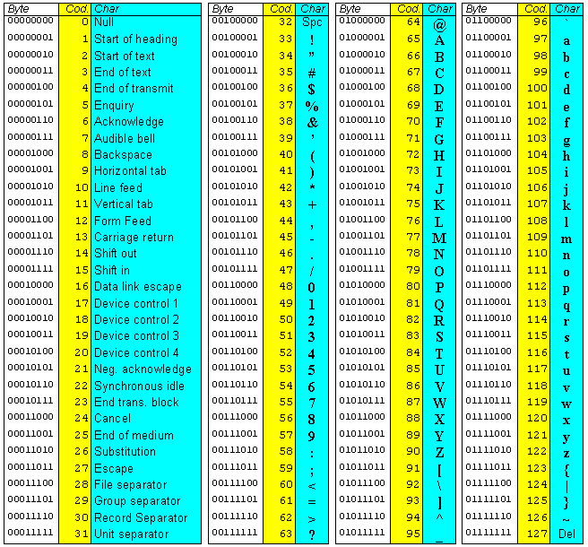

# Caratteri
Codifica **ASCII** su 1 Byte . 
Type : **char** con ' singolo
```c
    char c='a';//' != "
```
## int getchar()
```c 
    //INPUT
    char c=getchar();
    scanf("%c", &c);
    //OUTPUT
    putchar(c);//int putchar('A')
    printf(" c:%c", c);
    printf(" ASCII Code %c == %d", c, c);
```

Caratteri A < a
```c
char up_down(char a){
    if(a<='Z'){
        return a+('a'-'A');
    }
    return a+('A'-'a');
}
```
## ASCII


## include <ctype.h>
Fuzioni su char con 0 o 1 di return
 - int isalpha(char c) : se c è una lettera
    - Non un numero o un punto 
 - int isdigit(char c) : se c è una cifra
 - int islower
 - int isupper

# Stringhe
Vettori di caratteri
## '\0' == NULL
Carattere di terminazione stringa
Si usa il **"stringa!"** non '

Una stringa "a" è diverso da un carattere 'a'
char str[DIM+1];
```c
    char s[] =""; //s[0] ->'\0' 1 Byte
    'a' != "a"; //ASCII(a) 1 Byte != ASCII(a)+'\0'
    "a";//ASCII(a)+'\0' = 2 Byte
    char str[5] = "Ciao";//Se [4] no!. la stringa non termina
    printf("%s", str);//puts(str)
    scanf("%s", str);//gets(str)

    #include <string.h>
    str = "CIAO"; //NON Permesso, puntatore solo alla prima cella 
    char *strcpy(char *destinazione, const char *sorgente);
    int strcmp (const char *str1, const char *str2);//if 0 == Equal
    str3 = str1 + str2; //NON FUNZIONA, SOMMA SOLO INDIRIZZI
```

## Funzioni Stringhe
#include <string.h>
 - int sscanf(char *stringa, char *formato, espressione);
    Es. char s[20]="marco 33";char s1[20]="marco:33";
    sscanf(s, "%s %d", snome, n);//snome="marco", n=33;
    sscanf(s1, "%s:%d", snome, n);//snome="marco", n=33;
 - strcat(snome, " balda") -> "marco balda". snome[8] != snome[20]
    snome deve essere abbastanza grande da permettere la concatenazione
 - char *strcpy(char *destinazione, const char *sorgente);
 - int strcmp (const char *str1, const char *str2);//if 0 == Equal
    strcmp con str1>str2 -> >0 es."bba">"abb" altrimenti <0 
 - strlen(str) lunghezza stringa strlen("marco\0")->5

