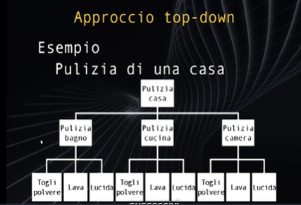

# Funzioni
## Top-Down


Approccio Top-Down anche detto approccio modulare.
Partizionare un programma in moduli, comporre il programma totale mettendo insieme i moduli.

Decomposizione di un problema in sotto problemi più semplici : soluzione ad albero.

**Linguaggi ad Oggetti** come Java o C++, basati sul paradigma di modularizzare i programmi

**Modularizzare** concetto di riuso e del top-down.

Subroutime == Procedure == Funzioni :
Sottoprogrammi che ritornano un risultato di qualche tipo, dopo aver ricevuto un ordine.

Passo parametri/argomernti e eseguo per avere un risultato.

**Invocare/Chiamare** una funzione si fa con il suo nome e le parentesi per i parametri.

In C le funzioni sono gestite una a una non c'è l'asincronicità. 
Es. main(){pippo()} -> pippo() -> main();

```c
int pippo(int n);// 0 - dichiarazione prototipo funzione

int main(){//1
    int n=10;
    n=pippo(n);//2
    return 0;//4
}

int pippo(int n){
    return n/2;//3
}
```
**Dichiarazione Prototipo** se usi una funzione devi prima della sua chiamata :
 - #include
 - Dichirazione Prototipo Funzione
 - Dichirazione Funzione

**Parametri Formali e Prametri Attuali**
```c
n=pippo(Prametri_Attuali)
//Definizione o Corpo:
int pippo(int Parametri_Formali){
    return Parametri_Formali/2;//3
}
```
### Definizione e Corpo
Prototipo e Funzione :
 1. Tipo ritorno funzione
 2. Nome funzione
 3. Tipi di ingresso con nomi parametri formali

Funzione tra grafe: 
 - 4. Dichiaro variabili
 - 5. Corpo Funzione : Sequenza finita di istruzioni/operazioni
 - 6. return tipo funzione

## Definizione vs Implementazione
```c
int read(int min, int max);//Definizione Prototipo

int read(int min, int max){//Definizione & Implementazione
    int n;
    if(min>max){
        return read(max,min);
    }
    printf("\nInserisci un numero tra %d e %d", min, max);
    scanf("%d", &n);
    printf("\n");
    if(n<=max && n>=min){
        return n;
    }else{
        printf("Non valido\n");
        return read(min, max);
    }
}
```
### modulo
```c
int modab(int a, int b){
    return (a>b)? a-b : b-a;
}
```

## Passaggio Parametri
1. Per Valore, **by value**
2. Per Indirizzo, **by reference** Es. Array(vettori e matrici)
```c
//By Value
int cubo(int b){
    return b*b*b;
}

//By Reference
void printA(int *A, int dim);

void plus_ten(int *n){
    *n = *n + 10;
}

void plus_n(int *v, int n){
    *v = *v + n;
}
```

### Pow
```c
float pow_b(int a, int b){
    if(b==0){//Caso base
        return 1;
    }else if(b>0){
        return a*pow_b(a, --b);
    }else{
        return (1.0/a)*pow_b(a, ++b);//1.0 sennò è perchè 0 -> 1/ int a != 1.0/ int a
    }
}
```

### Prime
Massimo comune divisore diverso da 1 allora non primi
```c
int mcd(int a, int b) {
    while (b != 0) {
        int temp = b;
        b = a % b;
        a = temp;
    }
    return a;
}

int are_coprime(int a, int b) {
    return mcd(a, b) == 1;
}
```
### log
log<sub>a</sub>b=c <-> a<sup>c</sup>=b

log<sub>2</sub>x = log<sub>e</sub>x /log<sub>e</sub>2
```c
#include <math.h>

int main() {
  double n = 8.0;
  double log_2 = log(n)/log(2);
  printf("%f", log_2);
  return 0;
}
```

### sqrt

```c
#include <stdio.h> 
//se metti (1/2) non funziona perchè int 0*...
double sqrt_a(double a, double prec){
    int i = 0;
    double x0 = a;
    for(; (x0-((1.0/2)*(x0+(a/x0)))>prec); i++){
        x0=(1.0/2)*(x0+(a/x0));
    } 
    return x0;
}

int main() {
  double n = 8.0;
  float sqrt_n = sqrt_a(n, 0.1);
  printf("Radice %f : %f\n", n, sqrt_n);
  scanf("%f", &n);
  return 0;
}
```
