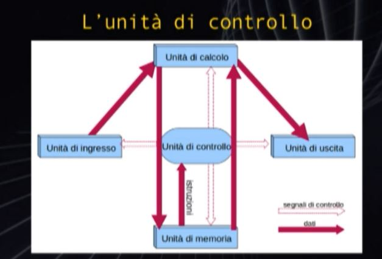
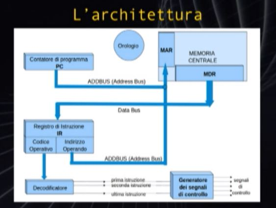

# Hardware
## Memoria Centrale
### Indirizzamento
La Memoria è organizzata in celle, che è la minima unità accessibile, esse possono essere chimate contemporaneamente, ad ogni cella è associato un indirizzo che è un numero binario e la identifica univocamente

**BUS** Fascio di Fili che collegano le celle di memorie

**Memoria Centrale** :
 - Lunghezza in byte delle sue inutà di memoria es.16bit
 - Indirizzi
# Architettura di un Calcolatore
Detta anche Struttura di un Calcolatore

**Ciclo Base di un Elaboratore** :
 1. Preleva un Istruzione dalla Memoria Centrale
 2. Interpreta l'Istruzione
 3. Esegue l'Istruzione e torno a 1

**Ciclo Base di un Elaboratore** :
 1. Fetch : Istruzione di Ricerca bastata su **PC**, il trasferimento di un informazione dalla memoria all'unità cenetrale dell'elaboratore
 2. Decodifica : Cosa bisogna fare?!
 3. Esecuzione
 4. Istruzione I-esima + 1 -> torno a Fetch

**PC** Program Counter, ricorda qual'è stata l'ultima Istruzione eseguita e quindi quale sarà la prima Istruzione da Eseguire

**Le Isruzioni** sono contenute in celle di memoria attigue l'una all'altra

 - **PC** : Programm Counter contiene l'indirizzo dell'istruzione
 - **MAR** : Memory Address Register, Registro che copntiene l'indirizzo della memoria dalla quale leggere o neella quale andare a scrivere
 - **MDR** : Memory Data Register, Registro di Transito in Ingresso o in Uscita, dalla Memoria Centrale
 - **IR** : Istruction Register, contiene separatamente il codice operativo dell'istruzione da Eseguire e L'Indirizzo della Cella di Memoria sulla quale andare operare tramite lettura o scrittura Es. STORE Memorizza l'istruzione
  
# Software

## Linguaggio Macchina
Composto da :
 1. Programma Sorgente : scritto in linguaggio intermedio
 2. Programma traduttore
 3. Istruzioni e Dati specificati bit per bit direttamente o tramite indirizzi

## Assembler e Compiler
**Assembler** 
Non serve più ricordare : codici di isruzione e indirizzi variabili

Es. load pippo -> 01100..1101

Un programma scritto in Assembler è composto da tante istruzioni quante le istruzioni in linguaggio di macchina prodotte dal programma Assemblatore/traduttore

**Compiler** 

**Linguaggi di Alto Livello**
Il sorgente non è più un Istruzione ma un **Programma**

Es. a=(pippo+3) -> load pippo, add 3, ...

### Livelli
1. Linguaggio macchina
2. Linguaggio Assembler (Assemblatore per lv 1)
3. Linguaggio Simbolico di Alto Livello (Compilatore per lv 2)

Programma sorgente (lv 3) se Tradotto diventa un Programma Oggetto

**Sistema a Schede** dove un istruzione è una scheda, le schede venivano messe in ordine e date al lettore di schede perforate. Il lettore leggeva le schede e portava le istruzioni alla memoria centrale. Nella Memoria Centrale il Programma Sorgente veniva Tradotto in Programma Oggetto. Programma Oggetto veniva contenuto in un altra sequenza di schede.

Dopo 1 o vari passaggi il Programma Oggetto diventava l'elaborato finale

**Sistema Operativo** Insieme di Programmi enorme che gestisce i dati in ingresso gli elabora per le uscite, gestsisce la memoria centrale, gestisce le risorse di calcolo distribuendole tra vari utenti e/o vari programmi